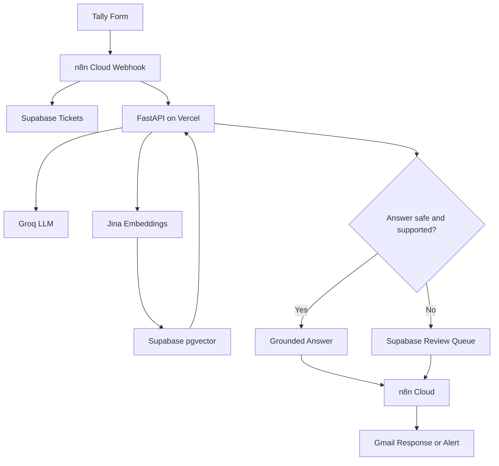

# university-support-copilot

University Student Support Copilot

An AI-powered student support automation system built as a portfolio project using FastAPI, Groq, Jina embeddings, Supabase pgvector, and n8n Cloud.

Status: Working end-to-end prototype
Purpose: Demonstrate AI workflow automation, retrieval-augmented generation (RAG), API security, evaluation, and human-in-the-loop handling.

«This is a fictional university demonstration project, not an official university service. Do not submit real student data.»

Problem

University support teams receive repetitive questions about fees, accounts, exams, enrollment, and student services. Automating routine responses can reduce manual work, but unsupported answers and sensitive requests require careful handling.

This project combines ticket classification with knowledge-grounded answering and human escalation.

Architecture

How it works

1. Ticket classification

The "/classify" endpoint uses a Groq-hosted language model to classify incoming tickets into one of 11 fixed categories:

- Fee Payment
- Account Access
- Account Update
- Portal Issue
- Result Issue
- Exam Issue
- Course Enrollment
- Certificate Request
- General Inquiry
- Sensitive Issue
- Unclear

The API validates model output against a Pydantic schema. Sensitive issues are deterministically assigned High priority and human review. Unclear or invalid categories fall back to "Unclear" and require review.

2. Knowledge-grounded answers

The "/answer" endpoint retrieves relevant knowledge-base chunks using Jina embeddings and Supabase pgvector, then asks the language model to answer using only the retrieved context.

Four safeguards control whether an answer can be returned:

1. Retrieval threshold: the highest similarity must reach "0.33".
2. Answerability: the model must indicate that the context supports an answer.
3. Source validation: at least one returned source ID must reference an actual retrieved chunk.
4. Decision requests: requests involving personal approvals, exceptions, refunds, or other decisions are escalated to a human.

Escalated cases are saved to the Supabase "review_queue" table. A draft answer may be provided for the reviewer, but it is not returned as the student-facing answer.

3. Automation and notifications

n8n Cloud connects the form, database, API, and email workflow. It sends confirmation emails and delivers automated answers when permitted. Error outputs on the API HTTP nodes trigger failure-alert emails.

Technology stack

- Python / FastAPI: API endpoints and validation
- Groq: language-model inference
- Jina AI: "jina-embeddings-v3" embeddings
- Supabase: PostgreSQL, pgvector, ticket storage, and review queue
- n8n Cloud: workflow orchestration
- Tally: ticket intake
- Gmail: confirmations, answers, and alerts
- Vercel: API deployment

API endpoints

All request bodies are JSON. Authenticated endpoints require an "x-api-key" header.

Endpoint| Authentication| Purpose
"GET /health"| None| Health check
"POST /classify"| API key| Classify a ticket
"POST /search"| API key| Retrieve relevant knowledge chunks
"POST /answer"| API key| Generate a grounded answer or escalate

Example: classify a ticket

POST /classify
Content-Type: application/json
x-api-key: YOUR_API_SECRET

{
  "student_name": "Demo Student",
  "student_id": "DEMO-001",
  "email": "student@example.com",
  "department": "Finance",
  "subject": "Fee payment",
  "description": "I need information about paying my semester fee."
}

Example: ask a question

POST /answer
Content-Type: application/json
x-api-key: YOUR_API_SECRET

{
  "question": "What is the process for paying semester fees?",
  "department": "finance",
  "top_k": 4
}

An answerable question returns an answer and source metadata. An unsupported or decision-related question returns "needs_human: true" and an escalation reason.

Local setup

Prerequisites

- Python compatible with the pinned dependencies
- A Supabase project with the required tables, pgvector setup, and "match_kb_chunks" database function
- API credentials for Groq and Jina

Install dependencies

From the repository root, run:

cd D:\university-support-copilot
python -m venv .venv
.\.venv\Scripts\Activate.ps1
python -m pip install -r .\api\requirements.txt

If PowerShell blocks virtual-environment activation, use an approved local execution-policy configuration rather than changing system security settings unnecessarily.

Configure environment variables

Create "api/.env" locally with these variables:

API_SECRET=your_local_api_secret
LLM_API_KEY=your_groq_api_key
LLM_MODEL=your_supported_groq_model
EMBED_API_KEY=your_jina_api_key
SUPABASE_URL=https://your-project.supabase.co
SUPABASE_SECRET_KEY=your_supabase_secret_key

Use real credentials locally, but never commit ".env" or publish secret values. The API secret must match the value configured in the calling n8n workflow when testing against that API deployment.

Run the API locally

From the repository root:

python -m uvicorn api.main:app --reload

Check "http://127.0.0.1:8000/health".

Ingest the knowledge base

The ingestion script scans the repository's "knowledge_base" directory recursively. Each ingested Markdown or text file must be directly inside one of these department folders: "academic_affairs", "finance", "it_support", or "student_services". In the current repository, these folders are nested under "knowledge_base/knowledge_base/". The separate "knowledge_base/docs/" folder is not ingested by the current script. It processes ".md" and ".txt" files whose immediate parent folder is one of the supported department names.

Run it from "api":

cd .\api
python ingest.py

The script uses Jina embeddings and upserts chunks into the Supabase "kb_chunks" table. Confirm your actual folder layout and database schema before running ingestion.

Testing and evaluation

The repository includes classification evaluation, retrieval tests, answer tests, security tests, and prompt-injection tests.

Recorded results from the current test set:

- Classification priority accuracy: 80% on 15 evaluation tickets
- "needs_review" evaluation: 100%
- API security tests: 11/11 passed
- Prompt-injection tests: 9/9 passed

These results describe the current test sets, not a guarantee of production reliability. Re-run tests after code, prompt, or configuration changes.

Limitations and safety

- The "0.33" retrieval similarity threshold is provisional and was selected using a small test set. It requires broader evaluation.
- Classification and answer quality depend on model behavior and knowledge-base coverage.
- Human review is required for sensitive issues, unsupported answers, and personal decision requests.
- A review-queue write failure can leave an escalation without a saved review record; monitor server logs and workflow alerts.
- The project is a portfolio prototype, not a production-ready university information system.
- Do not use real student records or confidential institutional documents in demonstrations.

Repository structure

api/
  main.py
  ingest.py
  requirements.txt
  eval.py
  eval_tickets.csv
  eval_results.csv
  security_test.py
  injection_test.py
  retrieval_test.py
  answer_test.py
knowledge_base/
README.md

Future improvements

- Expand evaluation with a larger, representative test set.
- Tune the retrieval threshold using measured precision and recall.
- Improve monitoring and retry handling for external services.
- Add a documented reviewer workflow for escalated tickets.

Author

Mehreen — BSCS graduate, Pakistan

Built as an AI automation and AI engineering portfolio project.
